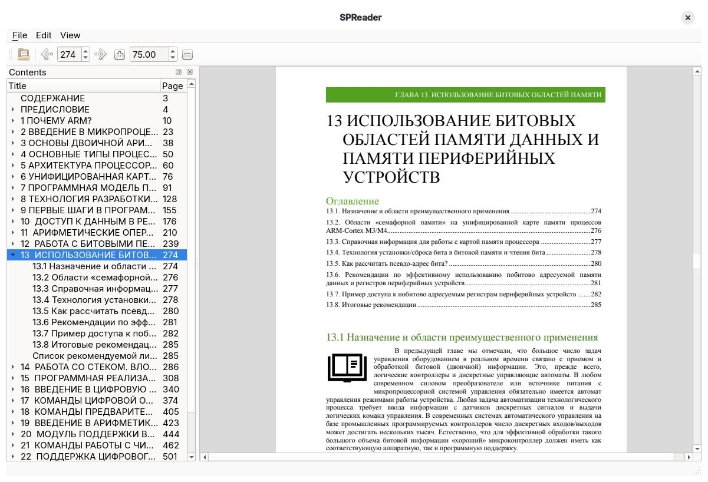

# SPReader

A fast, lightweight desktop document reader designed for viewing PDF, DJVU, and FB file formats. Developed in C++ utilizing the Qt framework.



## Features

- **Multi-format Support:** Seamlessly view PDF, DJVU, and FB documents.
- **Table of Contents:** Quick navigation panel with an interactive hierarchy outline.
- **Bookmarks & Favorites:** Quickly save and jump to important pages and sections.
- **Clean UI:** Responsive, minimalist design tailored for readability.

## Requirements

- **C++ Compiler:** C++17 support or newer.
- **CMake:** Version 3.16 or higher.
- **Qt Framework:** Qt 6 (with Core, Gui, Widgets, and PdfWidgets modules).

## Building the Project

```bash
mkdir build && cd build
cmake ..
make
```

